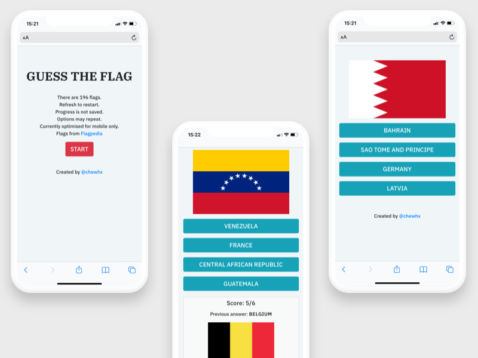

# Guess The Flag
- A game app built with React
- Currenly optimised for mobile only
- Open to anyone sharing ideas for a tablet or desktop UI 
- Created this as springboard and template for a larger idea (revision quiz app for study topics)

# Demo
View demo [here](https://guess-the-country-flags.herokuapp.comhttps://guess-the-country-flags.herokuapp.com)

# Screenshots

# Tools

- ReactJS
- VSCode
- Chrome

# Credits

- Country lists and details from [world-countries-capitals npm package](https://www.npmjs.com/package/world-countries-capitals)
- Flag images provided by [Flagpedia](https://flagpedia.net)
- [Heroku-React buildpack](https://github.com/mars/create-react-app-buildpack)
